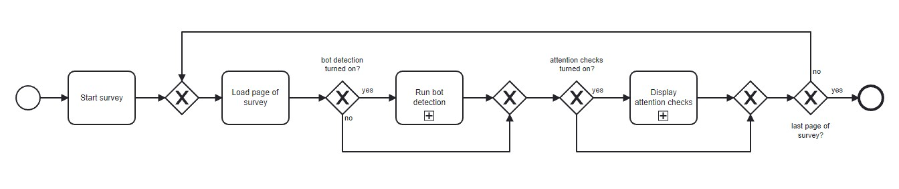

# Aims of the Package

In applied research, user feedback in various forms is necessary, including employing online surveys. 

# Statement of Need
Online studies, which are filled out by the participant in their browser, entail opportunities but also challenges [@online-studies; @online-studies2; @Maniaci.2014]. Conducting this type of study can be facilitated by simplified data collection, lower costs, improved participant-acquisition and accessibility [@online-studies; @online-studies2] and, generally speaking, may even enable the study to be conducted at all since no direct contact with the participant is necessary. Disadvantages also come with it, such as the participants clicking through the survey without being attentive, giving incorrect answers or even cheating [@online-studies; @Maniaci.2014]. This can lead to a data bias which endangers the result of the entire study.

# Comparison to Other Services/Packages

There exist services like [Prolific](https://www.prolific.co/), [MTurk](https://www.mturk.com/), [SurveySwap](https://www.surveyswap.io/), which do preliminary checks. However, these services still have a high bot rate, as a user can use bots after having sucessfully applied to these. Using these providers, participants are redirected to the researcher's data collection platform (LimeSurvey, Google Forms, etc.), therefore, malicious participants can then utilize bots. 

**SurveyGuardian** helps to detect the bots and inattentive participants that make it through the initial screenings.

# Examples of Features

[SurveyGuardian](https://github.com/SurveyGuardian/SurveyGuardian) provides various functions for detecting bots and inattentive behavior. However, the main goal of the plugin is to enable researchers to quickly and automatically include compliant attention checks and bot detection features - without much additional required work.
Nonetheless, there are several ways to costumize the plugin, for example, by determining the number of attention checks.
An overview of the client-side logic is shown in \autoref{fig:client-logic}.

## Bot Detection
The plugin includes the [FingerprintJS BotD framework](https://github.com/fingerprintjs/BotD) in version 1 (v1) for detecting bots.
If there are updates to version 1, the newest code will automatically be loaded.

## Adding Attention Checks
If you want to delete, add, or edit attention check questions, navigate to "SurveyGuardian > assets > attentionchecks.json" ([Link to attentionchecks.json](https://github.com/SurveyGuardian/SurveyGuardian/blob/master/SurveyGuardian/assets/attentionchecks.json)). Create new entries in the same pattern. 

# Focus on Usability
The plugin was implemented with a focus on usability. We included several researchers of our institution [Ulm University](https://www.uni-ulm.de/) in the development and evaluation process. **SurveyGuardian** was tested on version starting at 5.5.1.

# Licensing and Availability

**SurveyGuardian** is licensed under the GNU General Public License (v3.0), with all source code stored at GitHub (https://github.com/SurveyGuardian/SurveyGuardian), and with a corresponding issue tracker for bug reporting and feature enhancements. In the spirit of honest and open science, we encourage requests/tips for fixes, feature updates, as well as general questions and concerns via direct interaction with contributors and developers, by [filing an issue](https://github.com/SurveyGuardian/SurveyGuardian/issues/).

# Acknowledgments

# References
